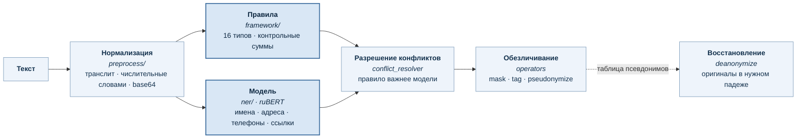

# pii-guard

**Обезличивание персональных данных в русском тексте.**

Находит персональные данные и убирает их из текста: маской или тегом — насовсем,
псевдонимом — обратимо. Работает и сам по себе, и прослойкой перед LLM: в модель
уходит обезличенный текст, а в её ответ возвращаются оригиналы.

[](LICENSE)
[](pyproject.toml)
[](https://huggingface.co/redmadrobot-rnd/rubert-base-pii-ner)



Правила ловят то, что проверяется контрольной суммой, модель — то, что суммой не проверить.
Подробнее — в [docs/architecture.md](docs/architecture.md).

Всего 20 типов сущностей.

| Тег | Сущность |
|---|---|
| `PERSON` | ФИО: имя, фамилия, отчество |
| `LOCATION` | адрес и его части: страна, регион, район, город, улица, дом |
| `PHONE_NUMBER` | телефон |
| `URL` | веб-адрес |
| `EMAIL_ADDRESS` | адрес почты |
| `INN` | ИНН физлица или организации |
| `SNILS` | СНИЛС |
| `OMS` | полис ОМС |
| `PASSPORT` | паспорт РФ |
| `DRIVER_LICENSE` | водительское удостоверение |
| `MILITARY_ID` | военный билет |
| `BIRTH_CERTIFICATE` | свидетельство о рождении |
| `CREDIT_CARD` | банковская карта |
| `BANK_ACCOUNT` | расчётный или корреспондентский счёт |
| `BIK` | БИК банка |
| `POSTAL_CODE` | индекс Почты России |
| `TELEGRAM` | телеграм-контакт `@username` |
| `IP_ADDRESS` | IP-адрес |
| `IP_PORT` | IP-адрес с портом |
| `DATE_TIME` | дата или время |

## Запуск

```bash
docker build -t pii-guard .
docker run --rm -p 127.0.0.1:8080:8080 pii-guard
```

```bash
curl -s localhost:8080/anonymize -H 'Content-Type: application/json' -d '{
  "texts": ["Иван Петров, ИНН 7707083893, тел. +7 916 123-45-67"],
  "mode": "pseudonymize"
}'
```

```json
{
  "mode": "pseudonymize",
  "items": [{
    "text": "<PII type=\"PERSON\" gender=\"male\" id=\"1\" />, ИНН <PII type=\"INN\" id=\"1\" />, тел. <PII type=\"PHONE_NUMBER\" id=\"1\" />",
    "normalized_text": "Иван Петров, ИНН 7707083893, тел. +7 916 123-45-67",
    "entities": [
      {"start": 0,  "end": 11, "entity_type": "PERSON",       "score": 0.7},
      {"start": 17, "end": 27, "entity_type": "INN",          "score": 0.9},
      {"start": 34, "end": 50, "entity_type": "PHONE_NUMBER", "score": 0.7}
    ]
  }],
  "mapping": {
    "<PII type=\"PERSON\" gender=\"male\" id=\"1\" />": "Иван Петров",
    "<PII type=\"INN\" id=\"1\" />": "7707083893",
    "<PII type=\"PHONE_NUMBER\" id=\"1\" />": "+7 916 123-45-67"
  }
}
```

Отдайте `text` модели, а `mapping` придержите у себя. Ответ модели верните на
`/deanonymize` вместе с таблицей — сервис подставит оригиналы обратно:

```bash
curl -s localhost:8080/deanonymize -H 'Content-Type: application/json' -d '{
  "texts": ["Свяжитесь с <PII type=\"PERSON\" gender=\"male\" id=\"1\" />"],
  "mapping": {"<PII type=\"PERSON\" gender=\"male\" id=\"1\" />": "Иван Петров"}
}'
```

→ `Свяжитесь с Иваном Петровым`. Прямая подстановка дала бы «с Иван Петров».

Третий эндпоинт — `GET /health`: показывает, поднялась ли модель и какие типы
доступны в этом развёртывании.

## Как библиотека

```bash
pip install ".[ner]"
python -m spacy download ru_core_news_sm
```

```python
from pii_guard import Anonymizer

a = Anonymizer()
r = a.anonymize("Иван Петров, ИНН 7707083893", mode="pseudonymize")

answer = call_your_llm(a.pseudonymize_system_prompt(), r.texts[0])
print(a.deanonymize(answer, r.mapping)[0])
```

`anonymize` принимает строку или список, а возвращает всегда списки —
`r.texts`, `r.entities`, `r.normalized_texts`. Таблица `r.mapping` одна на вызов.

## Режимы

| `mode` | Результат | Обратимо |
|---|---|---|
| `mask` | `Иван Петров` → `***********` | нет |
| `tag` | → `[PERSON]` | нет |
| `pseudonymize` | → `<PII type="PERSON" gender="male" id="1" />` | **да** |

Только `pseudonymize` обратим: тип сущности виден модели, одинаковые значения
получают один `id` даже в разных грамматических формах, род подсказан атрибутом.

## Варианты установки

```bash
pip install .                 # только правила, без torch и весов
pip install ".[ner,server]"   # + имена и адреса, + HTTP-слой
pii-guard-server              # поднять сервис без Docker, порт 8080
```

Без модели работают все типы с контрольными суммами. Недоступны четыре, которые
берёт только модель: `PERSON`, `LOCATION`, `PHONE_NUMBER`, `URL`. Образ без
весов: `docker build --build-arg EXTRAS=server --build-arg NER_DISABLED=1 .`

## Что важно знать

**Таблица псевдонимов нигде не хранится.** Сервис не имеет состояния: ни Redis,
ни TTL, ни идентификатора сессии. Таблица уезжает вызывающему и остаётся его
ответственностью.

**Смещения указывают на `normalized_text`, а не на присланный текст.**
Предобработка меняет длину строки — раскрывает транслит, сжимает пробелы. Резать
нужно `normalized_text` из ответа.

**Наружу не смотрит.** `pii-guard-server` слушает `127.0.0.1` — выставить наружу
можно только явным `PII_GUARD_HOST`. В контейнере процесс слушает `0.0.0.0`,
границей служит публикуемый порт: в примерах и в compose это `127.0.0.1:8080:8080`.
Авторизация опциональна и по умолчанию выключена, дефолтного ключа нет намеренно,
поэтому открытый порт означает открытый доступ.

## Дальше

- [examples/quickstart/demo.sh](examples/quickstart/demo.sh) — полный цикл против
  запущенного сервиса на одном `curl`; [examples/demo_app.py](examples/demo_app.py) —
  то же как библиотека
- [docs/architecture.md](docs/architecture.md) — архитектура по модели C4
- [docs/usage.md](docs/usage.md) — веса, переменные окружения, развёртывание, разработка
- [CONTRIBUTING.md](CONTRIBUTING.md) — как добавить новый тип сущности
- [SECURITY.md](SECURITY.md) — сообщить об уязвимости

## Лицензия

Apache-2.0, веса модели тоже. Копилефта в установке по умолчанию нет.

Единственное исключение придётся подключить руками. Extra `latin-gender` ставит
`gender-guesser` под **GPLv3**.
