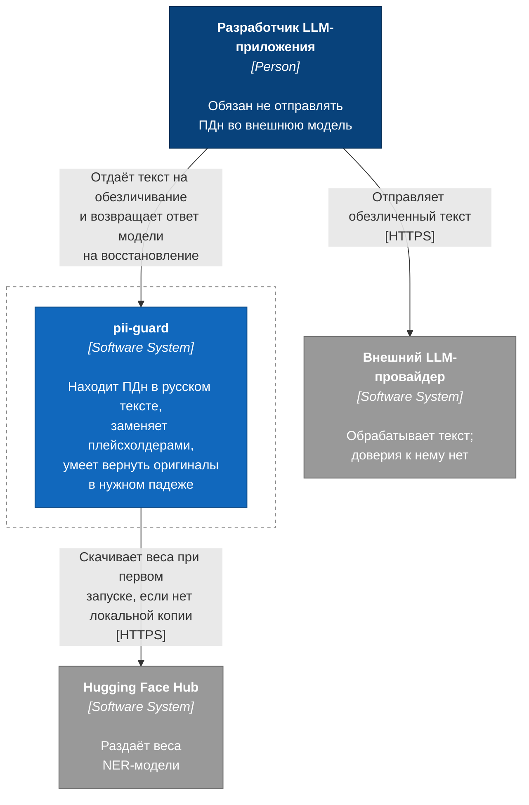
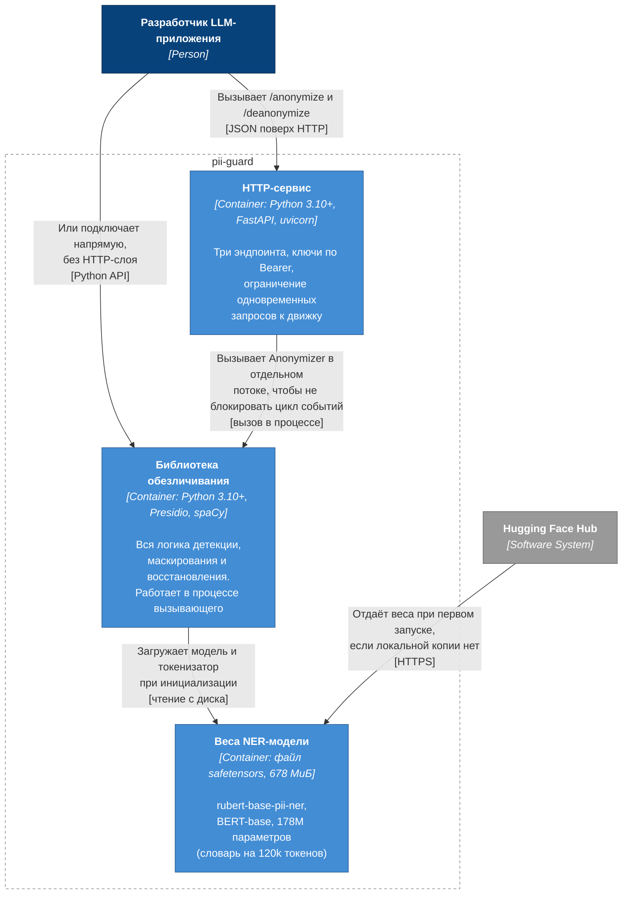
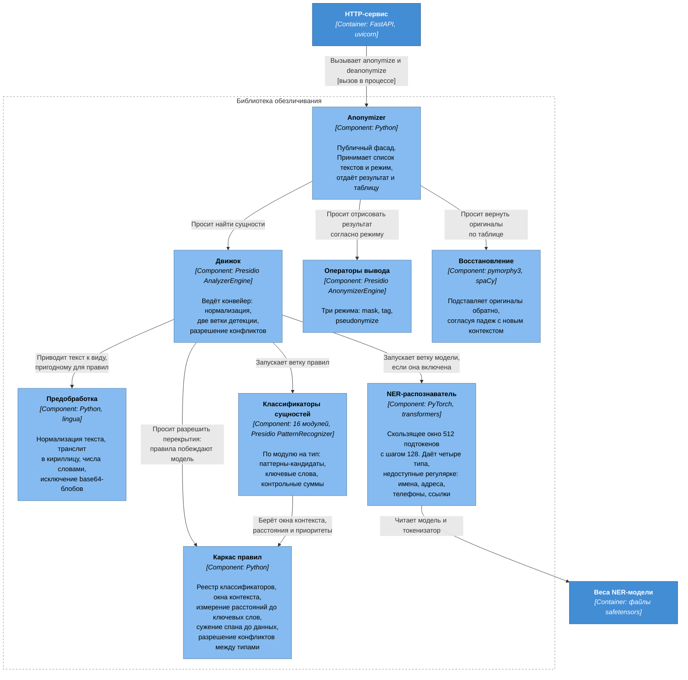

# Архитектура pii-guard

Описание по [модели C4](https://c4model.com/). Три уровня из четырёх: контекст,
контейнеры, компоненты. Уровень «код» не приводится — C4 рекомендует рисовать
только те уровни, которые дают ценность, а структура классов здесь читается из
исходников напрямую.

## Легенда

Обозначения одинаковы на всех диаграммах.

| Обозначение | Значение |
|---|---|
| `Person` | человек или роль, взаимодействующая с системой |
| `Software System` | система целиком; внешние — вне нашей зоны ответственности |
| `Container` | отдельно запускаемая или разворачиваемая единица: процесс, библиотека в процессе вызывающего, хранилище |
| `Component` | группа связанной функциональности внутри контейнера; отдельно не разворачивается |
| `[технология]` | реализация элемента в квадратных скобках |
| стрелка | однонаправленная связь; подпись выражает намерение, а не факт использования |

Сокращения: **ПДн** — персональные данные; **NER** — named entity recognition,
распознавание именованных сущностей; **LLM** — large language model.

---

## Уровень 1. Контекст системы

Аудитория: все, включая тех, кто не пишет код. Отвечает на вопрос, зачем система
нужна и с чем граничит.

Ключевое свойство контекста: **pii-guard не обращается к LLM сам**. Текст в
модель отправляет вызывающее приложение, а таблица соответствий остаётся у него.
Система не хранит состояние между запросами, поэтому утечка через неё возможна
только если сам вызывающий отправит таблицу наружу.

Обращение к Hugging Face Hub — единственный сетевой вызов, и он одноразовый.
После загрузки весов система работает без сети.

---

## Уровень 2. Контейнеры

Аудитория: разработчики и эксплуатация. Показывает, что именно разворачивается и
на чём.

### Почему библиотека — отдельный контейнер

По C4 контейнер — отдельно разворачиваемая единица. Библиотека ей является:
`pii-guard` устанавливается и используется без HTTP-слоя, а зависимости
`fastapi` и `uvicorn` лежат в опциональном экстра `server`. Развёртывание
библиотекой — не «внутренность» сервиса, а самостоятельный способ работы.

### Что разворачивается

| Вариант | Состав | Когда |
|---|---|---|
| Библиотека | `pii_guard` в процессе вызывающего | текст уже в Python-приложении |
| Библиотека без модели | `pii_guard` без экстра `ner` | нужны только документы с контрольными суммами |
| Сервис | образ с `pii_guard` + `pii_guard_server` | вызывающий не на Python, или движок нужен один на несколько приложений |

Веса выделены в контейнер, потому что у них свой жизненный цикл: 678 МиБ,
скачиваются один раз, версионируются коммитом на Hub, и в git не попадают
никогда.

---

## Уровень 3. Компоненты библиотеки обезличивания

Аудитория: те, кто меняет код. Разбирает единственный контейнер, где живёт вся
логика.

### Три решения, определяющие поведение

**Ветки независимы, конфликты разрешаются после.** Правила и модель не знают друг
о друге и работают по одному и тому же нормализованному тексту. При перекрытии
спанов побеждают правила: детерминированная контрольная сумма надёжнее
вероятностной оценки. Побочный эффект известен: ошибочное правило
гасит правильное предсказание модели, а не наоборот. Именно так выглядели оба
дефекта, из-за которых правила пришлось сузить по расстоянию.

**Ключевые слова оцениваются расстоянием, а не присутствием в окне.** Каркас
правил измеряет, насколько ключ близок к цифрам, и при споре побеждает ближайший.
Проверка «есть ли слово где-нибудь в окне ±260 символов» не выражает конкуренцию:
если в одном предложении два числа и два ключа, булев ответ неверен при любом
размере окна — «водительское удостоверение 77 АВ 123456, индекс 630009» требует
отклонить первые шесть цифр и принять вторые. Границы расстояний выбраны по
измеренному распределению: у `BIK` ключ во всей разметке стоит не дальше 24
символов слева, поэтому бюджет 40; у паспорта p99 = 83, поэтому близкое окно 80
и дальнее 160.

**Кандидат ищется по фразе, а отдаётся значение.** Документ узнаётся по ключевому
слову рядом с цифрами: `7518` само по себе не паспорт, `серия 7518, номер 492137`
— паспорт. Поэтому классификатор получает фразу целиком, а наружу каркас отдаёт
только данные внутри неё, разрезая их там, где стоит служебное слово. Маска
ложится на `серия ****, номер ******`, а не на всю фразу: «серия» и «номер» — не
персональные данные, тип и так объявлен в ответе, а плейсхолдер на всю фразу
ломает предложение сильнее, чем требуется. Составной номер при этом становится
двумя сущностями, как он и размечен в наборах, по которым система измеряется.

### Смещения относятся к нормализованному тексту

Предобработка меняет текст: сжимает пробелы, приводит длинное тире к дефису,
раскрывает транслит. Все `start` и `end` в ответе указывают на
`normalized_text`, а не на исходную строку. Для подсветки в оригинале нужен
собственный перенос смещений.

---

## Что диаграммы не показывают

Развёртывание (C4 допускает отдельную диаграмму) — здесь его нет, потому что
топология тривиальна: один процесс, состояния нет, горизонтальное масштабирование
копиями. Ограничение — память: экземпляр движка в процессе один, доступ к нему
сериализован семафором.

Уровень «код» не приводится сознательно. Классификаторы устроены единообразно —
`candidate_patterns`, `classify`, `priority` — и один прочитанный файл в
`entities/` объясняет остальные пятнадцать.
